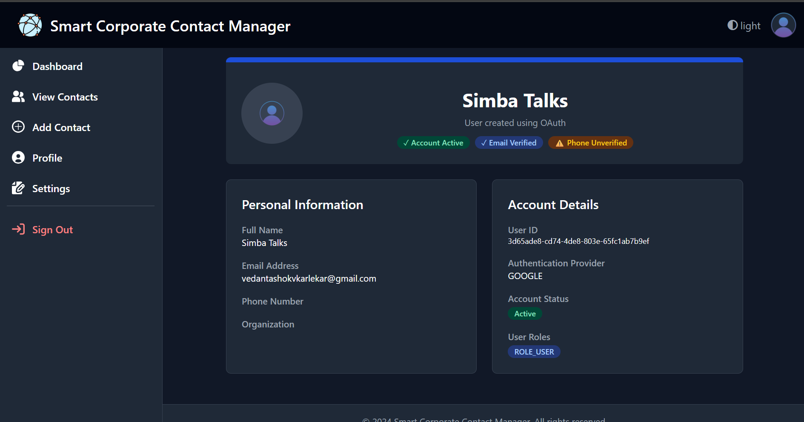
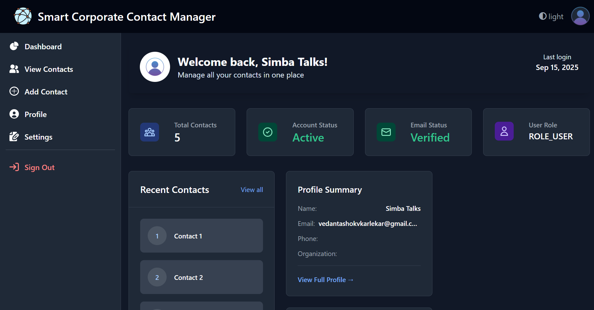
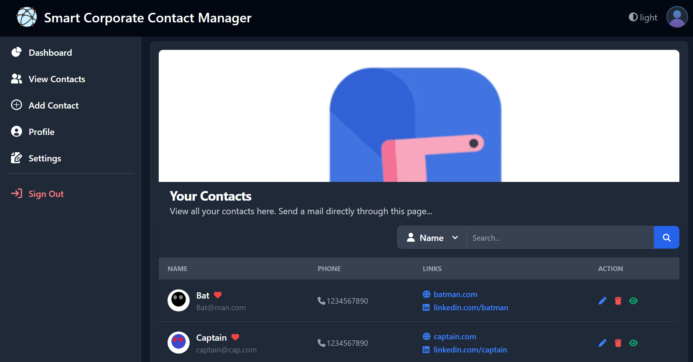
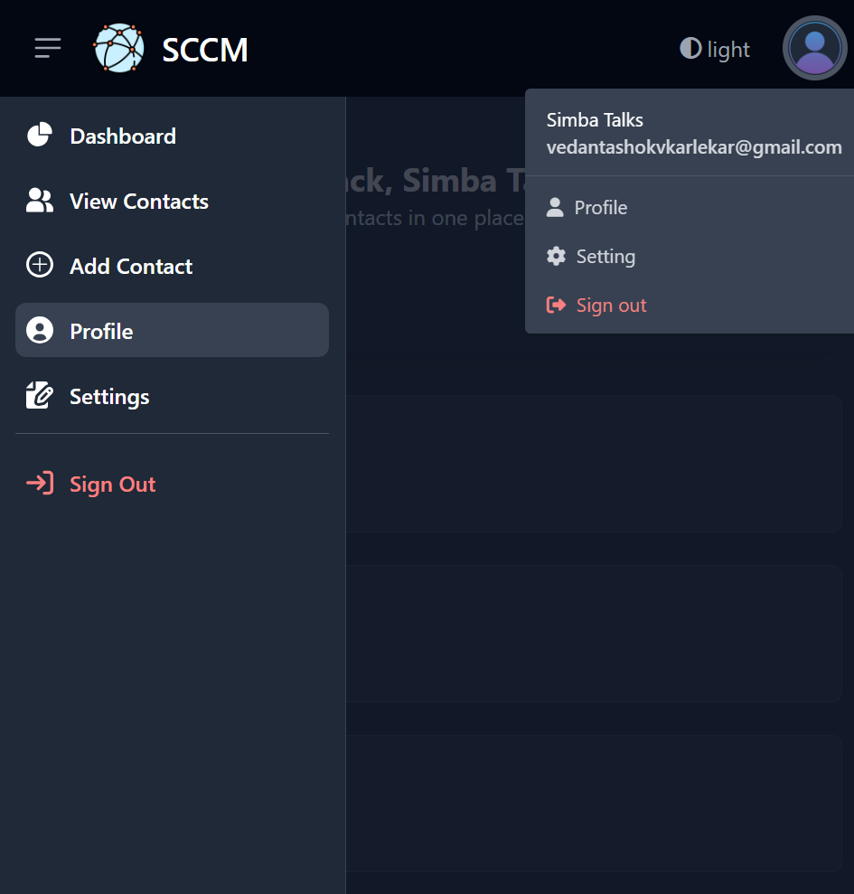

# Smart Corporate Contact Manager (SCCM)

A comprehensive web-based contact management system built with Spring Boot, designed to help professionals organize and manage their corporate contacts efficiently.

## 🌐 Live Demo

**[View Live Application](http://smartcorporatecontactmanager.ap-south-1.elasticbeanstalk.com)**

*Demo Credentials:*
- Email: `admin@gmail.com`
- Password: `admin`

## 📋 Table of Contents

- [Features](#features)
- [Technology Stack](#technology-stack)
- [Architecture](#architecture)
- [Getting Started](#getting-started)
- [API Documentation](#api-documentation)
- [Deployment](#deployment)
- [Screenshots](#screenshots)
- [Upcoming Features](#upcoming-features)
- [Contributing](#contributing)
- [License](#license)

## ✨ Features

### 🔐 Authentication & Security
- **Multi-provider Authentication**: Email/Password, Google OAuth2, GitHub OAuth2
- **Email Verification**: Secure account activation via email tokens
- **Spring Security Integration**: Role-based access control
- **Password Encryption**: BCrypt password hashing

### 👥 Contact Management
- **CRUD Operations**: Create, read, update, and delete contacts
- **Image Upload**: Cloudinary integration for profile pictures
- **Advanced Search**: Search by name, email, or phone number
- **Pagination & Sorting**: Efficient data browsing
- **Favorites**: Mark important contacts

### 🎨 User Interface
- **Responsive Design**: Mobile-first approach with Tailwind CSS
- **Dark/Light Theme**: User preference toggle
- **Modern Components**: Flowbite UI components
- **Interactive Modals**: Ajax-powered contact details view

### 🔧 Technical Features
- **RESTful APIs**: Complete API endpoints for mobile/external integration
- **Form Validation**: Client and server-side validation
- **Session Management**: Secure user sessions
- **Error Handling**: Comprehensive error management
- **Logging**: Detailed application logging

## 🛠 Technology Stack

### Backend
- **Java 17**
- **Spring Boot 3.x**
- **Spring Security 6**
- **Spring Data JPA**
- **MySQL Database**
- **Maven**

### Frontend
- **Thymeleaf Templates**
- **Tailwind CSS**
- **JavaScript (ES6+)**
- **Font Awesome Icons**
- **Flowbite Components**

### Cloud Services
- **AWS Elastic Beanstalk** (Hosting)
- **AWS RDS MySQL** (Database)
- **Cloudinary** (Image Storage)
- **Mailtrap** (Email Service)

### Development Tools
- **Spring Boot DevTools**
- **Lombok**
- **Maven**
- **Git**

## 🏗 Architecture

```
┌─────────────────┐    ┌──────────────────┐    ┌─────────────────┐
│   Frontend      │    │   Backend        │    │   External      │
│                 │    │                  │    │   Services      │
│ • Thymeleaf     │◄──►│ • Spring Boot    │◄──►│ • Cloudinary    │
│ • Tailwind CSS  │    │ • Spring Security│    │ • Mailtrap      │
│ • JavaScript    │    │ • Spring Data JPA│    │ • OAuth         │
│ • Flowbite      │    │ • RESTful APIs   │    │   Providers     │
└─────────────────┘    └──────────────────┘    └─────────────────┘
                                │
                                ▼
                       ┌─────────────────┐
                       │   Database      │
                       │                 │
                       │ • MySQL (AWS)   │
                       │ • JPA Entities  │
                       │ • Relationships │
                       └─────────────────┘
```

## 🚀 Getting Started

### Prerequisites

- Java 17 or higher
- Maven 3.6+
- MySQL 8.0+
- Node.js (for Tailwind CSS compilation)

### Installation

1. **Clone the repository**
   ```bash
   git clone https://github.com/yourusername/smart-contact-manager.git
   cd smart-contact-manager
   ```

2. **Database Setup**
   ```sql
   CREATE DATABASE sccm_db;
   ```

3. **Configure Application Properties**
   ```properties
   # Database Configuration
   spring.datasource.url=jdbc:mysql://localhost:3306/sccm_db
   spring.datasource.username=your_username
   spring.datasource.password=your_password
   
   # OAuth2 Configuration
   spring.security.oauth2.client.registration.google.client-id=your_google_client_id
   spring.security.oauth2.client.registration.google.client-secret=your_google_client_secret
   
   # Cloudinary Configuration
   cloudinary.cloud.name=your_cloud_name
   cloudinary.api.key=your_api_key
   cloudinary.api.secret=your_api_secret
   
   # Email Configuration
   spring.mail.host=your_smtp_host
   spring.mail.username=your_email
   spring.mail.password=your_password
   ```

4. **Install Dependencies & Build**
   ```bash
   # Install Node dependencies for Tailwind
   npm install
   
   # Build CSS
   npx tailwindcss -i ./src/main/resources/static/css/input.css -o ./src/main/resources/static/css/output.css --watch
   
   # Build the application
   mvn clean package
   ```

5. **Run the Application**
   ```bash
   mvn spring-boot:run
   ```

6. **Access the Application**
   ```
   http://localhost:8081
   ```

### Development Setup

1. **Enable Live Reload**
   ```bash
   # Terminal 1: Run Tailwind watch
   npx tailwindcss -i ./src/main/resources/static/css/input.css -o ./src/main/resources/static/css/output.css --watch
   
   # Terminal 2: Run Spring Boot
   mvn spring-boot:run
   ```

2. **Database Auto-Configuration**
   - Set `spring.jpa.hibernate.ddl-auto=update` for automatic schema creation
   - Use `spring.jpa.show-sql=true` for development debugging

## 📚 API Documentation

### Authentication Endpoints

| Method | Endpoint | Description |
|--------|----------|-------------|
| POST | `/authenticate` | User login |
| GET | `/logout` | User logout |
| POST | `/do-register` | User registration |
| GET | `/auth/verify-email` | Email verification |

### Contact Management APIs

| Method | Endpoint | Description |
|--------|----------|-------------|
| GET | `/api/contacts/{id}` | Get contact details |
| POST | `/user/contacts/add` | Create new contact |
| PUT | `/user/contacts/edit/{id}` | Update contact |
| DELETE | `/user/contacts/delete/{id}` | Delete contact |
| GET | `/user/contacts` | List all contacts (paginated) |
| GET | `/user/contacts/search` | Search contacts |

### Request/Response Examples

**Create Contact**
```json
POST /user/contacts/add
{
  "name": "John Doe",
  "email": "john@example.com",
  "phoneNumber": "1234567890",
  "address": "123 Main St",
  "description": "Business partner",
  "websiteLink": "https://johndoe.com",
  "linkedInLink": "https://linkedin.com/in/johndoe"
}
```

**Get Contact Response**
```json
{
  "id": "550e8400-e29b-41d4-a716-446655440000",
  "name": "John Doe",
  "email": "john@example.com",
  "phoneNumber": "1234567890",
  "address": "123 Main St",
  "description": "Business partner",
  "picture": "https://cloudinary.com/image/upload/v123/contact.jpg",
  "websiteLink": "https://johndoe.com",
  "linkedInLink": "https://linkedin.com/in/johndoe",
  "favorite": false
}
```

## 🚀 Deployment

### AWS Elastic Beanstalk Deployment

1. **Prepare Application**
   ```bash
   # Build production JAR
   mvn clean package -DskipTests
   ```

2. **Environment Variables**
   Set the following in Elastic Beanstalk configuration:
   ```
   DB_HOST=your_rds_endpoint
   DB_USERNAME=your_db_user
   DB_PASSWORD=your_db_password
   GOOGLE_CLIENT_ID=your_google_client_id
   GOOGLE_CLIENT_SECRET=your_google_client_secret
   CLOUDINARY_CLOUD_NAME=your_cloud_name
   CLOUDINARY_API_KEY=your_api_key
   CLOUDINARY_API_SECRET=your_api_secret
   ```

3. **Deploy**
   - Upload the JAR file from `target/` directory
   - Configure load balancer for HTTPS
   - Set up SSL certificate via AWS Certificate Manager

### Database Migration

- Production uses AWS RDS MySQL
- Schema automatically created via JPA
- Initial admin user created on startup

## 📸 Screenshots

### Homepage


### Dashboard


### Contact Management


### Mobile View


## 🔮 Upcoming Features

### 🤖 AI-Powered Features
1. **Smart Job Matching**: Web scraping integration to find relevant job openings based on user's contact network and professional background
2. **Vector-Based Recommendations**: AI-driven contact recommendations using machine learning to suggest valuable professional connections
3. **Contact Insights**: AI analysis of contact interaction patterns to provide networking insights and relationship strength indicators

### 🔍 Enhanced Search & Analytics
4. **Advanced Analytics Dashboard**: Visual representation of network growth, contact engagement metrics, and relationship mapping
5. **Smart Contact Categorization**: Automatic tagging and categorization of contacts based on industry, role, and interaction history

### 🌐 Integration & Collaboration
6. **LinkedIn Sync**: Direct integration with LinkedIn to import and sync professional contacts automatically
7. **Team Collaboration**: Multi-user workspaces for organizations to share and manage contacts collaboratively

## 🤝 Contributing

We welcome contributions! Please follow these steps:

1. **Fork the Repository**
2. **Create a Feature Branch**
   ```bash
   git checkout -b feature/amazing-feature
   ```
3. **Commit Changes**
   ```bash
   git commit -m 'Add amazing feature'
   ```
4. **Push to Branch**
   ```bash
   git push origin feature/amazing-feature
   ```
5. **Open a Pull Request**

### Development Guidelines

- Follow Spring Boot best practices
- Write unit tests for new features
- Update documentation for API changes
- Use conventional commit messages
- Ensure responsive design compatibility

### Code Style

- Use proper Java naming conventions
- Follow REST API standards
- Implement proper error handling
- Add logging for debugging
- Use Lombok annotations appropriately

## 📄 License

This project is licensed under the MIT License - see the [LICENSE](LICENSE) file for details.

## 👨‍💻 Author

**Vedant Karlekar**
- GitHub: [@yourusername](https://github.com/yourusername)
- LinkedIn: [Your LinkedIn](https://linkedin.com/in/yourprofile)
- Email: vedantkarlekar1@gmail.com

## 🙏 Acknowledgments

- Spring Boot team for the excellent framework
- Tailwind CSS for the utility-first CSS framework
- Flowbite for the UI components
- AWS for cloud hosting services
- Cloudinary for image management
- All open-source contributors

---

⭐ **If you find this project helpful, please give it a star!** ⭐