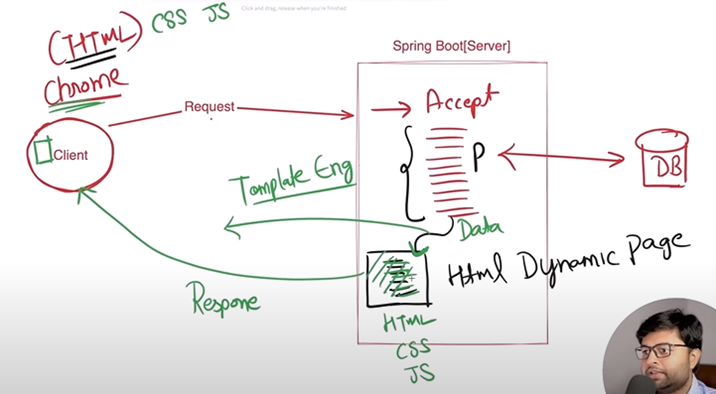
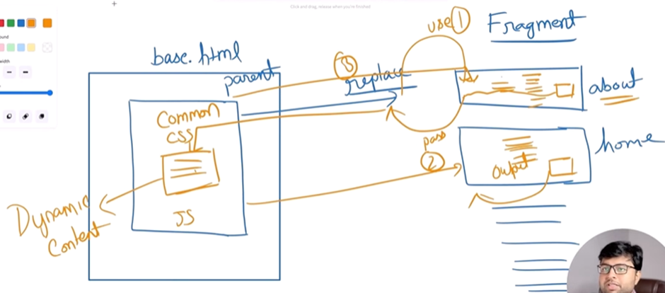
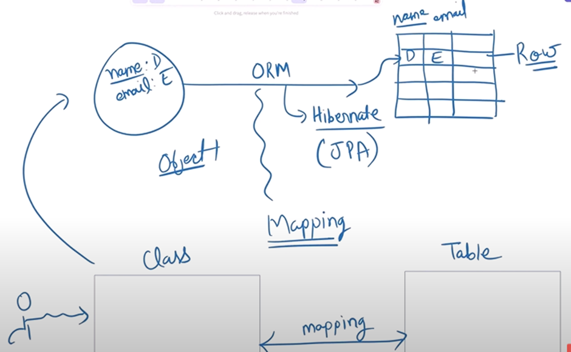
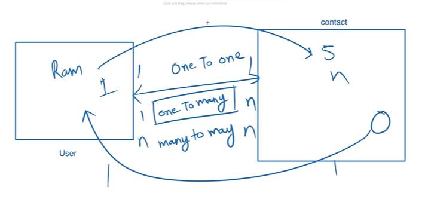
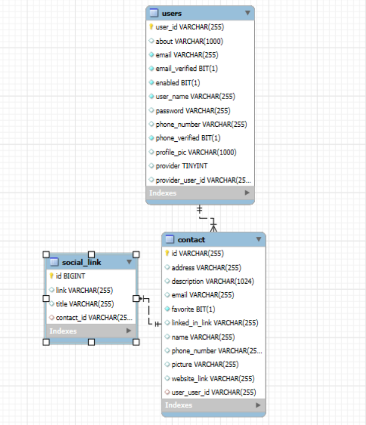

# Smart Corporate Contact Manager

## Spring Initializer – start.spring.io

1. Group – If project uploaded on maven’s site it needs to be unique, thus we have to follow standard to just reverse the domain name.

2. Artifact – Name of the project.
3.	Dependencies – Not needed to add all the dependencies at once, gradually add them.
    
    -	Spring Web – Manages web compatibility
    -	Thymeleaf – Our backend is been generated by backend only. We need template engine. To convert Spring Boot server to Dynamic HTML Response.
    

    - Data JPA – For SQL Database connection.
    - Validation – Bean Validation for Form validation.
    - Spring Security – Will Add later.
    - Outh2-client – Will Add later.
    - Model mapper – Will Add later.
    - Starter mail – Will add later.
    - *Lombok* – Annotation Library ready to user boiler plates.
    - Dev tools – Live reload.
    - MySQL Driver – For SQL Connection.

## Setup
1. DB 

-  src > main > resources > application.properties
        
    - url – tool:database:server:port/{db_name} username and password.
    - In SQL create schema > db_name. Columns will be generated by spring boot.

>**Note :** Ctrl + P helps to search anything from the project.

2. JPA
    
- ddl-auto – update is mandatory to reflect changes in database.

- Extra Details
    
    - Shows sql queries as we are learning to disable it when in production

    - If update is not set then schemas and tables wont be created

    - We have options like create, create-drop, validate etc. 

    - Can use dialect which automatically creates queries for specified database like mySQL, OracleSQL, postgreesSQL. Important if for some reason springboot fails to understand usually it is handled automatically.

    - Can use format_sql for formated version which is basically to learn sql in depth


## Basic Setup

[Internal Working of SpringBoot](https://youtu.be/tHDrxMklmPQ?si=KmiDBVNOzIb4gual)

Create file PageController which will control all the routing and all under com.sccm.controller

1. @Controller – We need a controller to handle a request. Controller can send dynamic data to HTML page. 
    
    - It returns a template which contains HTML src>main>resources>template>home.html if we are returning "home".

    - Dynamic data handling is done by taking Model as controller parameter. Adding any attribute to this model.

    - Extracting Data in HTML is done using thymeleaf `data-th-text=”${name}”` or `th:text = "${name}"` th stands for thymeleaf and displayed as text or th:href etc. data-th- are html friendly code, it will automatically populate that tag where it is mentioned. Using : method will highlight syntax error. 

    `<section th:replace="${content}"></section>`

2.	@RequestMapping(“{/url}”) – Makes a handler method which act as a return statement for the controller which usually returns name of the view.


```java
@Controller
public class PageController {

    @RequestMapping("/home")
    public String home(Model model){
        System.out.println("Home page Handler");
        model.addAttribute("name", "Welcome to Smart Corporate Contact Manager");
        model.addAttribute("paragraph", "Lorem ipsum, dolor sit amet consectetur adipisicing elit. Dolorum voluptatum quae amet optio adipisci voluptate, sint dolores minima consequuntur delectus, nihil sapiente consequatur praesentium saepe animi ducimus, esse architecto repellat a consectetur ipsum? Blanditiis repellendus eaque sint alias obcaecati molestiae magni quam quos voluptatibus assumenda deleniti voluptates, possimus et culpa?");
        model.addAttribute("link", "https://youtu.be/SAqi7zmW1fY?si=8CpQ6drnVwMlMLYl");
        //This is basically name of view.
        return "home";
    }
}
```
## Configuring [Tailwind](https://v3.tailwindcss.com/docs/installation)

- We can use Play CDN but its more for development purpose and not production.

- We have to initialize node in our project using `npm init -y` and add “type” = “module” in package.json. 

- Install tailwind `npm install -D tailwindcss` Initialize tailwind by `npx tailwindcss init` in tailwindconfig file add content path where the css content will be present.

- Add input and output css file to catch all the css changes used in our code. This output will be the main file which we would deploy add watch flag to make changes on runtime. `npx tailwind -i .\src\main\resources\static\css\input.css -o .\src\main\resources\static\css\output.css --watch`.

>**Note :** `npx tailwind -i .\src\main\resources\static\css\input.css -o .\src\main\resources\static\css\output.css --watch` Always add this to build input output css during live editing

- Add stylesheet of output file to insert css in our project  `<link rel="stylesheet" data-th-href="@{'/css/output.css'}"/>` Thyme leaf href is used with @ specifying relative path.
    
- Using Flowbite for components. 

## [Thymeleaf](https://www.thymeleaf.org/doc/articles/layouts.html) 

a.	Fragment
    
- Enables React type of component insertion in main.html in springboot, this react components are known as thymeleaf fragments. 

- Fragment can take variables and even markups to load individual components.

- Create a file which contains name of fragment ```<div class="fragment-tag" th:fragment="parent(x,y)">``` , Parameters can be accessed by ```<h1>Value of x is <span th:text="${x}"></span> </h1>```. The parameters are actually passed from child fragment to parent fragment. Refer 4th point.

- Thymeleaf Namespace

```html
<html lang="en"
th:fragment="parent(content, title, script)"
xmlns="http://www.w3.org/1999/xhtml"
xmlns:th="http://www.thymeleaf.org">
```
    
- Use this fragment in any page. We can either insert or replace in base div. ```<div class="host-tag" th:insert="~{base :: parent('one', 'two')}">```, ~{filename :: fragment name} and One and two are the parameters passed.

- Using `th:replace` replaces the child's html.

- Passing markup from child to parent – ```<div class="host-tag" th:insert="~{base :: parent(~{::section})}">```, reference of section or any passing parameter below this div will be passed to parent. To pass via id/ class `th:replace="~{base :: parent(~{::#main-content})}"`/ `th:replace="~{base :: parent(~{::.main-content})}"`

- Fetched using ```<div class="fragment-tag" th:fragment="parent(content)">``` ```<div th:replace="${content}"></div>``` replace as we don’t want that div instead want to load the fragment.

- Dynamic use of Thymeleaf and Model passing model attribute as isLogin. `<div class="host-tag" th:replace = "${isLogin} ? ~{base :: parent(~{::section})} : ~{base :: error(.logon)}">`

b. Layouts



i.	Creating Base HTML which is act as a base template for all the common things like CSS file, thymeleaf namespace, flowbite plugin.

ii.	Creating a Child parameter which will take content from the fragment at the same time pass parameter to the parent and eventually displays it on our base page.

iii. Refer Fragments 7 & 8 points

```html
    <!-- Base -->
    <html lang="en" th:fragment="parent(content, title, script)">
        <title th:replace="${title}"></title>

    <!-- About -->
    <html lang="en" th:replace="~{base::parent(~{::#content},~{::title}, ~{::script})}">
```

>**Note :** For using href we use @ `<a data-th-href = "@{'/home'}">Home</a>`. 

## [Flowbite](https://flowbite.com/)

- Flowbite helps to make everything responsive.

- Static folders are directly accessible. 

### Dark Mode Toggle

- Using Font [awesome](https://fontawesome.com/) for icons/logo.
    
- We can use components directly without downloading using [cdn](https://cdnjs.com/libraries/font-awesome) link.
    
- localStorage an object of browser stores the data related to individual system and updates the theme.

- Passing theme and removal of old theme from html tag as a class is mandatory.

- Get theme - `let theme = localStorage.getItem("theme");`, Set theme - `localStorage.setItem("theme", theme)`, HTML class - `document.querySelector("html").classList.add(currentTheme);`


## Model and Entity



- Create Entities under com.sccm.entities

>**Note:** spring.jpa.hibernate.ddl-auto=update property must be set to reflect changes in DB

- Class is created with annotation Entity which acts as Object which will be mapped. Table annotation can be used to further specify details like custom table name, if not specified Entity's name will be considered as table name.

- All the parameters of the class are considered as the row to the table. Id annotation makes a parameter primary key, Column annotation can be used to assign further specifications like name, unique, nullable, length etc.

- We created an Enum for Providers, Enums are basically fixed parametric values.

- Getter, setter, constructor and builder can be made dynamically using **lambook** annotation.


- Mapping in Java Class



```java
@Entity(name = "user")
@Table(name = "users")
//Lambook
@Getter
@Setter
@AllArgsConstructor
@NoArgsConstructor
@Builder
public class User {

    @Id
    private String userId;

    @Column(name="user_name", nullable=false)
    private String name;

    @OneToMany(mappedBy = "user", cascade = CascadeType.ALL, fetch = FetchType.LAZY, orphanRemoval = true)
    private List<Contact> contacts = new ArrayList<>();
}

public class Contact {
    @Id
    private String id;

    @ManyToOne
    private User user;

    @OneToMany(mappedBy = "contact", cascade = CascadeType.ALL, fetch = FetchType.EAGER, orphanRemoval = true)
    private List<SocialLink> links = new ArrayList<>();
}
```

- One user can have multiple contacts and Many contacts can be associated with user

- Decoding `@OneToMany(mappedBy = "user", cascade = CascadeType.ALL, fetch = FetchType.LAZY, orphanRemoval = true)` mappedBy gives preference to Contact's user to be the governing column if it's not specified another table get created to facilitates bidirectional mapping. cascade deletes everything if user is deleted. FetchType.Lazy only runs query whenever its necessary. In links EAGER is used to fetch the associated links as soon as contacts are fetched. Orphans can be deleted.

- WorkBench > Database > Reverse Engineer



- `@GeneratedValue(strategy = GenerationType.IDENTITY)` Auto Increments the value of the id.

- `@Enumerated(value = EnumType.STRING) private Providers provider = Providers.SELF;` Using Enumerated as Annotation makes the value restrictions for only those strings.

## Sign Up Screen

### Front end 

- Using flowbite for easy element

- Grid is very strong so basically we have divided grid in 12 columns. `<div class="grid grid-cols-12">`. Blank div accounts for white space before our form helps to align it. `<div class="md:col-span-2 lg:col-span-3 xl:col-span-4"></div>` Specifying for all the screen sizes makes it dynamic -> sm - [0-12-0], sm - [2-8-2], sm - [3-6-3], sm - [4-4-4]. `<div class="col-span-12 md:col-span-8 lg:col-span-6 xl:col-span-4">`.

### Backend

- For form action specify thymeleaf action `<form class="space-y-6" data-th-action="@{'/do-register'}" method="post">`

- Inside controller specify value and method under RequestMapping `@RequestMapping(value = "/do-register", method = RequestMethod.POST)`

- To redirect to same register page `return "redirect:/login";`

- Create a class src/main/java > com.sccm > forms > UserForm.java. Name of the variables in the class should be the same as User Entity.

- Pass the object of UserForm in register controller function only.

- We can pass default value too for the form to fetch.

```java
public String registerPage(Model model) {
    UserForm userForm = new UserForm();
    // We can add default data also
    userForm.setName("Vedant");
    model.addAttribute("userForm", userForm);
    return "register";
}
```

- In the html view we can extract is by mentioning the `th:object` and `th:field` but th:field is followed by *.

    `<form data-th-action="@{'/do-register'}" method="post" data-th-object="${userForm}">`

    `<input type="text" name="name" id="name" placeholder="Enter here" required th:field="*{name}" />`

- Get data in do-register function `public String processRegister(@ModelAttribute UserForm userForm)`. Specify @ModelAttribute fetches models used in form.

**Managing Data with DB**

1. **Repository**
    
    For DB connection we need to create a Repo interface which extends JpaRepository. We can add function names `findBy<Attribute>` and Data JPA will automatically write its function body. But for this we create new package under com.sccm > repositories(package) > UserRepo(interface). This repo is used for Extra methods db related operation, custom query method,custom finder method.

    ```java
    @Repository
    public interface UserRepo extends JpaRepository<User, String>{
        //Function is automatically created by Spring Data GPA
        Optional<User> findByEmail(String email);
        //We can also add combination of two attributes
        Optional<User> findByEmailAndPassword(String email, String Password);
    }
    ```
2. **Services**

    Repository can be direct used under controller but to follow proper layered architecture we create services and its implementation. 

    - *Services*

        com.sccm > services(Package) > UserService(Interface). It contains all the methods which would be used. Optional is used to handle if the data is not present in DB, it is java.utils implementation only.A container object which may or may not contain a non-null value. If a value is present, isPresent() returns true. If no value is present, the object is considered empty and isPresent() returns false.Additional methods that depend on the presence or absence of a contained value are provided, such as orElse() (returns a default value if no value is present) and ifPresent() (performs an action if a value is present).

        ```java
            public interface UserService {
            User saveUser(User user);
            Optional<User> getUserById(String id);
            Optional<User> updateUser(User user);
            void deleteUser(String id);
            boolean isUserExist(String userId);
            boolean isUserExistByEmail(String email);
            List<User> getAllUsers();
            // Add more methods related to user service logic.
        }
        ```
    - *Implementation*

        com.sccm.services > implementation(package) > UserServiceImpl(class). It implements UserServices and write function body. We use logger from `import org.slf4j.Logger;` to log details. Check [UserServiceImpl](../src/main/java/com/sccm/services/implementation/UserServiceImpl.java) for code. Autowired is used in place of Constructor injection ideally constructor injection should be used. We wrote new exception for userNotFound under com.sccm > helper(package) > ResourceNotFoundException(class) extending `RuntimeException`.

        ```java
        public class ResourceNotFoundException extends RuntimeException{
            public ResourceNotFoundException() {
                super("Resource not found");
            }
            public ResourceNotFoundException(String message) {
                super(message);
            }
        }
        ```

- Using everything in controller. Declare a variable with userService. and build it using the data from userForm. This is how builder works.

```java
User user = User.builder()
.name(userForm.getName())
.email(userForm.getEmail())
.password(userForm.getPassword())
.phoneNumber(userForm.getPhoneNumber())
.organization(userForm.getOrganization())
.about(userForm.getAbout())
.profilePic("src\\main\\resources\\static\\images\\profile.png")
.build();

User savedUser = userService.saveUser(user);
```

- But this method of using builder doesn't fetch default value. Thus we use normal constructor. Using like this fetches default value of provider as self earlier it was not getting fetch.

```java
User user = new User();
user.setName(userForm.getName());
user.setEmail(userForm.getEmail());
user.setPassword(userForm.getPassword());
user.setPhoneNumber(userForm.getPhoneNumber());
user.setOrganization(userForm.getOrganization());
user.setAbout(userForm.getAbout());
user.setProfilePic("src\\main\\resources\\static\\images\\profile.png");
User savedUser = userService.saveUser(user);
```

**Message Handling**

- Take alerts from flowbite create a thymeleaf fragment and insert it in register.
- To control Pop up of alert we can use it in request but we will use session in Handler. `public String processRegister(@ModelAttribute UserForm userForm, HttpSession session){}`. Then add attribute in session `session.setAttribute("message", "Registration Successful !");`.
- `<div th:if="${session.message}" th:fragment="messageBox">` Checking if session has message or not. Then displaying the message `<span th:text="${session.message}"></span>`.

>**Note :** But heres a catch if once user has register and he refreshes the screen the message will still exist in his session indicating already register.

- Making Message dynamic under helper create Message enum containing type of message. Create a class of message which has content and type. To use default value in builder we need to use `@Builder.Default`.

```java
public class Messages {
    private String content;
    @Builder.Default
    private MessageType type = MessageType.blue;
}
```

- Using it in controller - `Messages message= Messages.builder().content("Registration Successful !").type(MessageType.green).build();`

- Fetching in Message.html using `<div th:if="${session.message}" th:object="${session.message}" th:fragment="messageBox">` and fetching content using `<span th:text="*{content}"></span>`

**Important**

>**Note :** Message html changing class dynamically - `<div th:if="${session.message}" th:object="${session.message}" th:fragment="messageBox" th:classappend="*{'text-'+type+'-800  border-'+type+'-300 bg-'+type+'-50 dark:text-'+type+'-400  dark:border-'+type+'-800 dark:bg-'+type+'-900'}" id="alert-border-3" class="mt-2 flex items-center p-4 border-t-4" role="alert">`

**Important**

- Removing message from session is done by creating a helper class.RequestContextHolder - Holder class to expose the web request in the form of a thread-bound RequestAttributes object we extract requestAttributes and type cast RequestAttributes to ServletRequestAttributes to get request and get session via it. As getRequestAttributes can throw null pointer exception so wrap in a try catch block.

```java
@Component
public class SessionHelper {
    public static void removeMessage(){
        try {
            System.out.println("Removing Message from session");
            HttpSession session = ((ServletRequestAttributes)RequestContextHolder.getRequestAttributes()).getRequest().getSession();
            session.removeAttribute("message");   
        } catch (Exception e) {
            System.out.println("Error in SessionHelper: "+ e);
            e.printStackTrace();
        }
    }
}
```

- Calling this method from HTML. `<th:block th:text="${@sessionHelper.removeMessage()}"></th:block>`. As we have specified @Component thus we can directly use sessionHelper as an object and call it's function.

**Form Validation**

- spring-boot-starter-validation will be used for validation. Annotations used for the same are `@Size(min = 8, max = 12, message = "Invalid Phone Number") @NotBlank(message = "Phone Number is required") @Email(message = "Invalid Email Id") @Pattern(<regex expression>)`

- In Page Controller we have to add the following `public String processRegister(@Valid @ModelAttribute UserForm userForm, BindingResult rBindingResult,HttpSession session)` and just need to check is error exists in rBindingResult `if(rBindingResult.hasErrors())return "register";`

- In Register.html first remove onClient form check `<form novalidate>` then  userForm object already has all the error regarding attributes. #fields: This is a built-in Thymeleaf object that provides access to information about form fields and their validation status, error can be extracted using .hasError('<field name>'). Error can be simply extracted using *{<field name>}. `<p th:if="${#fields.hasErrors('organization')}" id="filled_error_help"><span th:errors = "*{organization}">Some error message.</span></p>`. Additionally I am removing reset button when there are errors. ` <div th:if="${!#fields.hasErrors()}"> Wrong Input? <button type = "reset" >Rest Details</button></div>`.


## Spring Security

We will protect all the url followed by /user. Create new controller UserController under `com.sccm.controller`, it will have all the url's following user.

>**Note :** In `@RequestMapping(value="/dashboard", method=RequestMethod.GET)` if we are passing 2 variable we need to specify value="". If we are just using @RequestMapping than no need to add value and method is defaulted to GET. `@RequestMapping("/dashboard")`

Just by downloading [Springboot Starter Security](https://docs.spring.io/spring-security/reference/getting-spring-security.html), automatically a login page appears when we try to access our URL with credentials.

### Thus types of user configuration -

1. Automatic user configuration

    >**Note :** 'user' : user and 'password' : Auto-generated and specified in console. 

2. Properties file

    We can specify custom user password under `src>main>resources>application.properties` `spring.security.user.name=admin spring.security.user.password=admin`.

3. Dynamic users 

    We want to make it dynamic for all the user in DB they can login.

    Create a new package `com.sccm` > config inside it create a class SecurityConfig. 

    >**Note :**A SecurityConfig class is typically created in Spring Boot applications to define and customize the security configurations using Spring Security. 

    This class, often annotated with @Configuration and @EnableWebSecurity, allows for specifying security rules, authentication mechanisms, authorization policies, and other security-related settings.

    - In-Memory 

        If user is already present i.e. universal User like admin > admin in local memory we can user in memory service. We don't usually use this in production only used for testing, prototypes and demos.

        ```java
        @Configuration
        public class SecurityConfig {
            @Bean
            public UserDetailsService userDetailsService(){
                //User from .security
                BCryptPasswordEncoder encoder = new BCryptPasswordEncoder();
                UserDetails user1 = User
                    .withUsername("admin")
                    //Encoder is mandatory
                    .password(encoder.encode("admin"))
                    .roles("ADMIN", "USER")
                    .build();

                var inMemoryUserDetailsManager = new InMemoryUserDetailsManager(user1);

                return inMemoryUserDetailsManager;
            }
        }
        ```

        UserDetailsService bean in Spring Security, which is responsible for providing user information (username, password, roles) used for authentication UserDetailsService is an interface Spring Security uses to load user data during login. We create a password encoder to securely hash passwords using the BCrypt algorithm. Storing plain text passwords is not secure, and BCrypt adds hashing + salting.

    - DB Link

    >**Note :** Most important and production level use

    When login request comes for username and password AuthenticationProvider is trigger. We use DaoAuthenticationProvider which has methods to configure UserDetails and PasswordEncoder.

    Spring security uses UserDetails to deal with all the methods to validate users. Rather than creating new class we extend our [User](../src/main/java/com/sccm/entities/User.java) to implement userDetails and include the unimplemented methods.

    One Key method is getAuthorities() which specifies the roleList each user is assigned with. Stream part is interesting.
    ```java
    public class User implements UserDetails{
        ...
        //To fetch all the roles of the users, it is list as user can be admin/user/client
        @ElementCollection(fetch = FetchType.EAGER)
        private List<String> roleList = new ArrayList<>();

        @Override
        public Collection<? extends GrantedAuthority> getAuthorities() {
            //We can return normal List of String we need Collection which extends GrantedAuthority 
            Collection<SimpleGrantedAuthority> roles = roleList.stream().map(role -> new SimpleGrantedAuthority(role)).collect(Collectors.toList());
            return roles;
        }
    }
    ```

    Need to add this part in UserServiceImpl also. Added encoder and list on roles. Hardcoding values is not a good practice thus we create new class under `com.sccm.helper` AppConstants and added `public static final String ROLE_USER = "ROLE_USER";`.

    ```java
        @Autowired
        private PasswordEncoder passwordEncoder;
        @Override
        public User saveUser(User user) {
            //user id needs to be generate unique and randomly
            String userId = UUID.randomUUID().toString();
            user.setUserId(userId);
            //Password encoding
            user.setPassword(passwordEncoder.encode(user.getPassword()));
            //Role list
            user.setRoleList(List.of(AppConstants.ROLE_USER));
            logger.info(user.toString());
            //Default profile pic
            return userRepo.save(user);
        }
    ```

    Now finally we create our custom userDetail service which implements UserDetailService for authentication under `com.sccm.services.implementation` > class SecurityCustomUserDetailService. loadUserByUsername is the main method which fetches details about the user for authentication, findByEmail uses Optional so we need to throw error if not found.

    ```java
        @Service
        public class SecurityCustomUserDetailService implements UserDetailsService{

            @Autowired
            private UserRepo userRepo;

            @Override
            public UserDetails loadUserByUsername(String username) throws UsernameNotFoundException {
                //Load our user details
                return userRepo.findByEmail(username).orElseThrow(() -> new UsernameNotFoundException("User not found with this email -> " + username));
            }

        }
    ```

    Finally our UserConfig looks like
    ```java
    @Configuration
    public class SecurityConfig {


        @Autowired
        private SecurityCustomUserDetailService userDetailService;

        @Bean
        public AuthenticationProvider authenticationProvider(){
            //DaoAuthenticationProvider has all the methods to register the service
            DaoAuthenticationProvider daoAuthenticationProvider = new DaoAuthenticationProvider();

            //User detail service object :
            daoAuthenticationProvider.setUserDetailsService(userDetailService);
        
            //Password encoder object but we are using direct
            daoAuthenticationProvider.setPasswordEncoder(passwordEncoder());
            return daoAuthenticationProvider;
        }

        @Bean
        public PasswordEncoder passwordEncoder(){
            return new BCryptPasswordEncoder();
        }
    ```

This will secure all the url's but we need to free some urls like login, register and home thus we need to add this security to particular routes. Thus in security config we add FilterChain. It calls authorizeHttpRequests internally which takes a lambda function which has authorizeHttpRequest on which we can perform the functions.

>**Note :** But the matchers are ordered specific thus generalize permissions should be last and specific important permissions should precede other.

```java
    httpSecurity.authorizeHttpRequests((authorize) -> {
        // authorize.requestMatchers("/home", "/register")permitAll();
        authorize.requestMatchers("/user/**").authenticated();
        authorize.anyRequest().permitAll();
    });
```


### User [Login](https://docs.spring.io/spring-security/reference/servlet/authentication/passwords/form.html) 

But now as we have hampered with existing functionality we are not redirected to login url on hitting secured urls to add this we add `httpSecurity.formLogin(Customizer.withDefaults());`

To redirect to our login page we use `formLogin.loginPage("/login");` and login form gets submitted to `loginProcessingUrl("/authenticate")`. Method chaining we can either write `formLogin.loginPage("/login"); formLogin.loginProcessingUrl("/authenticate");` or chain it `formLogin.loginPage("/login").loginProcessingUrl("/authenticate");`. We can also add lots of parameters as shown in the code.

```java
    httpSecurity.formLogin(formLogin ->{
        formLogin.loginPage("/login")
        .loginProcessingUrl("/authenticate")
        // Changed from successForwardUrl defaultSuccessUrl perform client side rendering which is better for login 
        // .successForwardUrl("/user/dashboard")
        //In successForwardUrl we use server side which makes the form to resubmit it again which causes error
        .defaultSuccessUrl("/user/dashboard", true)  
        .failureUrl("/login?error=true")
        .usernameParameter("name")
        .passwordParameter("password")
        // .failureHandler(new AuthenticationFailureHandler() {
        //     @Override
        //     public void onAuthenticationFailure(HttpServletRequest request, HttpServletResponse response,
        //             AuthenticationException exception) throws IOException, ServletException {
        //         // TODO Auto-generated method stub
        //         throw new UnsupportedOperationException("Unimplemented method 'onAuthenticationFailure'");
        //     }
        // })
        // .successHandler(new AuthenticationSuccessHandler() {
        //     @Override
        //     public void onAuthenticationSuccess(HttpServletRequest request, HttpServletResponse response,
        //             Authentication authentication) throws IOException, ServletException {
        //         // TODO Auto-generated method stub
        //         throw new UnsupportedOperationException("Unimplemented method 'onAuthenticationSuccess'");
        //     }
        // })
        ;
    });
```

We ran into a problem where `.successForwardUrl("/user/dashboard")` didn't work but `.defaultSuccessUrl("/user/dashboard", true)` worked. Because

1. defaultSuccessUrl redirects the client (browser) to `/user/dashboard` using a 302 HTTP redirect. So after login, the browser makes a new GET request to `/user/dashboard`.
2. .successForwardUrl forwards the request on the server-side after login — meaning: 
    - Spring does not tell the browser to go to a new URL.
    - It internally dispatches the login request to /user/dashboard.
    - HTTP method remains POST (because login form submits a POST).

>**Note :** Most of the time, defaultSuccessUrl(...) is preferred because it avoids double form submission issues. It aligns with how most web apps behave after login.

### User Logout

Like login default functionality was hampered default logout functionality was also hampered which needs to be explicitly specified. Using

```java
    //Configure Logout page
    httpSecurity.logout(logoutForm -> {
        //By default /logout uses get request.
        logoutForm.logoutUrl("/logout")
        .logoutSuccessUrl("/home");
    });
```

But this fails as default logout spring security uses GET request to logout. But spring security enables CSRF token by default which only permits POST request to tackle CSRF attacks so either we can do two things.

1. Write custom logout form which caters to POST request.
2. Turn off CSRF token 

Doing the later one for temporary fix

`httpSecurity.csrf(AbstractHttpConfigurer::disable);` AbstractHttpConfigurer has a method to disable csrf we are simply using method reference.

## Login with google

[OAuth2 client](https://mvnrepository.com/artifact/org.springframework.security/spring-security-oauth2-client/6.5.0) dependency needs to be added in the project, it already has spring security in it thus if we simply add OAuth 2 still we could configure everything regarding security.

We need to add providers client id and client secret.
For [Google](https://console.cloud.google.com/welcome/new) > Create new project > API & Services > OAuth Consent screen > 

Video steps are different the Dashboard looks different but isn't hard to go around instead of credential we have overview > Create OAuth client.
>**Note :** AUthorized redirect URI specifies on which URL user will be redirected once authorized. This is predefined URL by springboot and if any change leads to mismatch `http://localhost:8081/login/oauth2/code/google`

Thus after creation client id and client secret is generated. use it in application.properties
```properties
spring.security.oauth2.client.registration.google.client-name=google
spring.security.oauth2.client.registration.google.client-id={Client Id}
spring.security.oauth2.client.registration.google.client-secret={Client Secret}
spring.security.oauth2.client.registration.google.scope=email,profile
```
Adding the Oauth2 in security config will enable the google login
```java
    //Default login page
    httpSecurity.oauth2Login(Customizer.withDefaults());
```
Login Logout functionality works just fine.
Basically when default login google button is triggered it redirects to [/oauth2/authorization/google](http://localhost:8081/oauth2/authorization/google)

Adding Social Buttons on login.html and assigning above href to the buttom
>**Note :** Shorthand to add div with class `div.social-buttons-container`

### User Configuration

Using our custom login page security Config file will include - 
```java
    @Autowired
    private OAuthAuthenticationSuccessHandler handler;
    //Customized page
    httpSecurity.oauth2Login(oAuth -> {
        oAuth.loginPage("/login")
        .successHandler(handler)
        ;
    });
```
We Create OAuthAuthenticationSuccessHandler to store data coming from the OAuth into the DB and to configure successURL. Create new class under config itself > OAuthAuthenticationSuccessHandler.java and implement AuthenticationSuccessHandler where we have to implement onAuthenticationSuccess method. 
>**Note :** `authentication.getPrincipal()` holds the user data and `user.getAttributes()` store all the attributes we get from the login Provider. 

```java
@Component
public class OAuthAuthenticationSuccessHandler implements AuthenticationSuccessHandler {

    @Autowired
    private UserRepo userRepo;

    @Override
    public void onAuthenticationSuccess(HttpServletRequest request, HttpServletResponse response,
            Authentication authentication) throws IOException, ServletException {
                //Save Data before redirect
                DefaultOAuth2User user = (DefaultOAuth2User)authentication.getPrincipal();

                String email=user.getAttribute("email").toString();
                String name=user.getAttribute("name").toString();
                String picture=user.getAttribute("picture").toString();

                User dbUser = new User();
                dbUser.setEmail(email);
                dbUser.setName(name);
                dbUser.setProfilePic(picture);
                dbUser.setPassword("password");
                dbUser.setUserId(UUID.randomUUID().toString());
                dbUser.setProvider(Providers.GOOGLE);
                dbUser.setEnabled(true);
                dbUser.setEmailVerified(true);
                dbUser.setProviderUserId(user.getName());
                dbUser.setRoleList(List.of(AppConstants.ROLE_USER));
                dbUser.setAbout("User created using google login");

                User existingUser = userRepo.findByEmail(email).orElse(null);
                if(existingUser == null){
                    userRepo.save(dbUser);
                }

                //Using response
                // response.sendRedirect("/user/dashboard");
                //Using RedirectStrategy
                new DefaultRedirectStrategy().sendRedirect(request, response, "/user/dashboard");
    }
}
```
We can redirect user either by using response or using RedirectStrategy() which is good practice.

## Login with Github

Go to [https://github.com/settings/developers](https://github.com/settings/developers) add homepage URL - [http://localhost:8081](http://localhost:8081/) same done with google and callback URL as [http://localhost:8081/login/oauth2/code/github](http://localhost:8081/login/oauth2/code/github).
Uncheck webhook option. Account Permission > Profile > read and write. Account Permission > Email Permission > Only read.
After app creation we get client id and can generate client secret.

Each provider gives different attributes check the attributes using - 
```java
    oAuthUser.getAttributes().forEach((key, value) ->{
        logger.info("{} => {}", key, value);
    });
```

## Using Logger

Implement logger from `org.slf4j.Logger`. Create a logger which is class specific and use logger.info() to display data like System.out.println().

```java
    Logger logger = LoggerFactory.getLogger(OAuthAuthenticationSuccessHandler.class);

    logger.info("OAuthAuthenticationSuccessHandler");
    logger.info(user.getName());

    user.getAttributes().forEach((key, value) ->{
        logger.info("{} => {}", key, value);
    });

    logger.info(user.getAuthorities().toString()); -> this gives all the authorities we checked while on google cloud

    User existingUser = userRepo.findByEmail(email).orElse(null);
    if(existingUser == null){
        userRepo.save(dbUser);
        logger.info("User saved: " + email);
    }
```

## Fetching User details post login

We can inject Authentication in request mapping. Create a Helper class inside sccm.helpers which will have function to fetch username/user email.

```java
    @RequestMapping(value="/profile", method=RequestMethod.GET)
    public String userProfile(Authentication authentication) {
        String name = getEmailOfLoggedInUser(authentication);
```

In Helper class, refer OAuthAuthenticationSuccessHandler how we extracted data to store in DB.
```java
public class Helper {
    public static String getEmailOfLoggedInUser(Authentication authentication){

        //Provider logic
        if(authentication instanceof OAuth2AuthenticationToken){
            var oAuth2AuthenticationToken = (OAuth2AuthenticationToken)authentication;

            var clientId = oAuth2AuthenticationToken.getAuthorizedClientRegistrationId();

            var oAuth2User = (OAuth2User)authentication.getPrincipal();
            String username = "";

            //Google
            if(clientId.equalsIgnoreCase("google")){
                username = oAuth2User.getAttribute("email").toString();
            }
            //Github
            else if(clientId.equalsIgnoreCase("github")){
                username = oAuth2User.getAttribute("email") != null ? oAuth2User.getAttribute("email").toString() : oAuth2User.getAttribute("login").toString() + "@gmail.com";
            }

            return username;
        }else{
            //simple
            return authentication.getName();
        }
    }
}
```

We have fetched the email so we need a method to fetch user from db with this email id. Add method getUserByEmail UserService `User getUserByEmail(String email);` and add it's implementation in UserServiceImpl
```java
    @Override
    public User getUserByEmail(String email) {
        return userRepo.findByEmail(email).orElse(null);
    }
```

Now either we can do 2 things just add the userDetail in one requestMapping or add it in every requestMapping and we can access it if user is logged in else it would be null. Thus we create RootController inside sccm.controller and Annotate it with `@ControllerAdvice` and make a method which will perform all the fetching and annotating it with `@ModelAttribute` which make this method common to all the models in every requestMapping.

```java
@ControllerAdvice
public class RootController {

    private Logger logger = LoggerFactory.getLogger(this.getClass());
    @Autowired
    private UserService userService;
    
    @ModelAttribute
    public void addLoggedInUserInformation(Model model, Authentication authentication){
        //If user is not logged in
        if(authentication == null) return;
        logger.info("Adding logged in user info to the model");
        String userEmail = getEmailOfLoggedInUser(authentication);
        User user = userService.getUserByEmail(userEmail);
        model.addAttribute("loggedInUser", user);
    }
}
```

Access the data in any html using `<h1 th:text="${loggedInUser.name}"></h1>`.

## Dashboard & Profile page

We separated our base.html on the basis of loggedInUser. And added new Nav bar + Side bar from flowbite used help of claude to make UI uniform.

```html
<!-- if user is logged in -->
<body th:if="${loggedInUser}">
<!-- if user is not logged in -->
<body th:unless="${loggedInUser}">
```

## Add contact Form

Create ContactController add a view add_contact.html, upload image was little tricky. ` rounded-lg` (full rounded corners) Changed to: `rounded-none rounded-e-lg` (only right side rounded). Helps to connect icon with input area.

Create a Form entity to pass in as model to the form `ContactForm`. Added its model to the controller model and passed it as an object to our html template. 

```java
    @RequestMapping("/add")
    public String addContactView(Model model){

        ContactForm contactForm = new ContactForm();
        // contactForm.setName("Test");
        model.addAttribute("contactForm", contactForm);
        return "user/add_contact";
    }
```

In html we will use same route just change the method to post and use the object.
`<form class="mt-2" th:action="@{'/user/contacts/add'}" th:object="${contactForm}" method="post">` And assign the variables to fields input parameters. `<input th:field="*{name}">` What it does is that it auto assign id, name and value field of that tag based on the variable as above field will automatically have id = "name", name = "name", value = <value of the name field>.


### Processing Contacts

Create `ContactRepo.java` in Repo folder so that data can be extracted and inserted from DB. 
>**Note :** Custom query written in the Repo if column name doesn't exist in table so write a query to fetch the data. params - `:userId, @Param("userId") String userId`

```java
@Repository
public interface ContactRepo extends JpaRepository<Contact, String>{

    //Find contact by user
    //Custom finder method
    List<Contact> findByUser(User user);

    //Custom function if we want to fetch on the basis of User id as user id is not present in the table
    //Custom Query method
    @Query("SELECT c FROM Contact c WHERE c.user.Id = :userId")
    List<Contact> findByUserId(@Param("userId") String userId);
}
```

Write interface for contactService declare all the methods related to contact. Write it's implementation contactServiceImpl class this is annotated with @Service.

In controller add the contactForm models data to an contact entity and add it to DB using repo.

>**Note :** Logged in user's data is fetched using `Authentication authentication` parameter and extracted using `String username = Helper.getEmailOfLoggedInUser(authentication);`

```java
    @Autowired // In protection ready application constructor should be used
    private ContactService contactService;

    @Autowired
    private UserService userService;

    @RequestMapping(value = "/add", method = RequestMethod.POST)
    public String saveContact(@ModelAttribute ContactForm contactForm, Authentication authentication){

        //Process form data
        // get data of root user
        String username = Helper.getEmailOfLoggedInUser(authentication);

        User user = userService.getUserByEmail(username);
        //form --> contact
        Contact contact = new Contact();

        contact.setName(contactForm.getName());
        contact.setFavorite(contactForm.getFavorite());
        contact.setEmail(contactForm.getEmail());
        contact.setPhoneNumber(contactForm.getPhoneNumber());
        contact.setAddress(contactForm.getAddress());
        contact.setDescription(contactForm.getDescription());
        contact.setUser(user);
        contact.setWebsiteLink(contactForm.getWebsiteLink());
        contact.setLinkedInLink(contactForm.getLinkedInLink());
        //save into DB
        //Process form data

        contactService.save(contact);
        System.out.println(contact);
        System.out.println(contactForm);
        return "redirect:/user/contacts/add";
    }
```


### Form validation

Add validation tags on ContactForm
```java
    @NotBlank(message="Name is required")
    private String name;

    @NotBlank(message="Email is required")
    @Email(message="Invalid Email Address")
    private String email;

    @NotBlank(message="Phone number is required")
    @Pattern(regexp="^[0-9]{10}$", message="Invalid Phone Number")
    private String phoneNumber;
```

Pass them to the controller using `public String saveContact(@Valid BindingResult result)` and `if(result.hasErrors()) return "user/add_contact";` in html display error using #fields where pass the name of the variable which is bind by the validation rule. Fetch the error message using `th:errors="*{name}"`

```html
    <!-- Error if any -->
    <p
      th:if="${#fields.hasErrors('name')}"
      class="mt-2 text-red-600 dark:text-red-400"
    >
      <span class="font-medium">Oh, snapp!</span>
      <span th:errors="*{name}">Some error message.</span>
    </p>
```

Display Message, use `HttpSession session` as parameter we have already added Message entity using that will display message and display the message in the html using `<div th:replace="~{message::messageBox}"></div>`. Backend is already handled earlier

```java
    @RequestMapping(value = "/add", method = RequestMethod.POST)
    public String saveContact(@Valid @ModelAttribute ContactForm contactForm, BindingResult result, Authentication authentication, HttpSession session){
        if(result.hasErrors()){
            session.setAttribute("message", Messages.builder().content("Please correct the following errors").type(MessageType.red).build());
            return "user/add_contact";
        }
    }
```

### Image handling

Create account on [Cloudinary](https://cloudinary.com/) follow [Java Integration](https://cloudinary.com/documentation/java_integration) steps. Add dependency mentioned in the document. In application property add name key and secret from dashboard > api key.
```
cloudinary.cloud.name=
cloudinary.api.key=
cloudinary.api.secret=
```

In add_contact.html make form as `<form class="mt-2" th:action="@{'/user/contacts/add'}" th:object="${contactForm}" method="post" enctype="multipart/form-data">` enctype="multipart/form-data" makes our form ready to handle the image.

Create ImageService and it's implementation to handle uploading image onto Cloudinary. In service add method uploadImage and getUrlFromPublicId. Its implementation is as followed.

**Uploading Image** - 
- `byte[] data = new byte[contactImg.getInputStream().available()];` creates a byte array of size of image.
- `contactImg.getInputStream().read(data);` stores contactImg data onto our array.
- Upload this array onto the Cloudinary variable with public_id i.e. name as filename(Generated using UUID) passed in the parameter. `cloudinary.uploader().upload(data, ObjectUtils.asMap("public_id", filename));`
- Calls `getUrlFromPublicId(filename)` to generate a transformed URL for accessing the uploaded image.
- Image upload is handled by `getUrlFromPublicId(filename)` after transforming the image to satisfy our requirements.
- `.generate(publicId)` uploads the image and url extraction is done using `.url()`.

>**Note :** Replacement of autowired with constructor is done as in below code.

```java
@Service
public class ImageServiceImpl implements ImageService{

    private Cloudinary cloudinary;

    //Instead of autowired, constructor automatically injects the data
    public ImageServiceImpl(Cloudinary cloudinary) {
        this.cloudinary = cloudinary;
    }    

    @Override
    public String uploadImage(MultipartFile contactImg, String filename) {
        //upload image

        try {
            byte[] data = new byte[contactImg.getInputStream().available()];
            contactImg.getInputStream().read(data);
            cloudinary.uploader().upload(data, ObjectUtils.asMap(
                "public_id", filename
            ));
        } catch (IOException e) {
            // TODO Auto-generated catch block
            e.printStackTrace();
            return null;
        }

        return this.getUrlFromPublicId(filename);
    }

    @Override
    public String getUrlFromPublicId(String publicId){

        return cloudinary
        .url()
        .transformation(
            new Transformation<>()
                .width(AppConstants.CONTACT_IMG_WIDTH)
                .height(AppConstants.CONTACT_IMG_HEIGHT)
                .crop(AppConstants.CONTACT_IMG_CROP)
        )
        .generate(publicId);
    }
}
```

We need our Cloudinary Object to have certain specifications at time of creation itself. Thus we create an AppConfig class inside `com.sccm.config`. This makes sure at the time of object creation itself name, key and secret get assigned to the object. `"${cloudinary.cloud.name}"` this fetches the value from application.property. ObjectUtils.asMap sets the properties inside the object.

```java
@Configuration
public class AppConfig {

    @Value("${cloudinary.cloud.name}")
    private String cloudName;

    @Value("${cloudinary.api.key}")
    private String apiKey;

    @Value("${cloudinary.api.secret}")
    private String apiSecret;

    @Bean
    public Cloudinary cloudinary(){
        return new Cloudinary(
            ObjectUtils.asMap(
                "cloud_name",cloudName ,
                "api_key", apiKey,
                "api_secret", apiSecret
            )
        );
    }
}
```

File url is captured in the ContactController and saved in the DB.

```java
    String fileName = UUID.randomUUID().toString();
    String fileUrl = imageService.uploadImage(contactForm.getContactImg(), fileName);
    contact.setPicture(fileUrl);
    contact.setCloudinaryImagePublicId(fileName);
    contactService.save(contact);
```

## View Contact

ContactController class is already mapped to

```java
    @Controller
    @RequestMapping("/user/contacts")
    public class ContactController {}
```

Thus to write function which will trigger for the above url we simply mention
```java
    @RequestMapping
    public String viewContact()
```

### UI 
Flowbite template -> table.

**Looping contacts**

>**Notes :** th:each acts as a for each loop within pageContent, declaring an th:object helps us to use the parameters of foreach variable freely. *{name} and all are the attributes of the pageContent.

```html
  <tr
    th:object="${c}"
    th:each="c : ${Contact}"
    class="bg-white border-b dark:bg-gray-800 dark:border-gray-700 border-gray-200 hover:bg-gray-50 dark:hover:bg-gray-600"
  >
    <th
      scope="row"
      class="flex items-center px-4 py-4 text-gray-900 whitespace-nowrap dark:text-white min-w-[200px]"
    >
      
      <div class="ps-3 min-w-0 flex-1">
        <div class="flex items-center gap-2 flex-wrap">
          <div class="text-base font-semibold truncate" th:text="*{name}">
            Neil Sims
          </div>
          <i th:if="*{favorite}" class="fa-solid fa-heart text-red-500 text-sm"></i>
        </div>
        <div class="font-normal text-gray-500 truncate" th:text="*{email}">
          contact@sccm.com
        </div>
      </div>
  </th>
```

### Pagination

**Note :** `org.springframework.data.domain` enables us to implement pagination easily. Page, Pageable, Sort, PageRequest all are part of this module

**Contact Repo**

We change findByUser of ContactRepo to return Page<Contact> and add Pageable to parameter list. `Page<Contact> findByUser(User user, Pageable pageable);`

**Contact Service**

Edit getByUser in ContactService Interface also to support above change. `Page<Contact> getByUser(User user, int page, int size, String sortField, String sortDirection);`

**Contact Service Implementation**

In its implementation we can sort data and it goes as followed -

```java
    @Override
    public Page<Contact> getByUser(User user, int page, int size, String sortBy, String sortDirection) {
        // TODO Auto-generated method stub
        Sort sort = sortDirection.equals("desc")? Sort.by(sortBy).descending() : Sort.by(sortBy).ascending();
        Pageable pageable = PageRequest.of(page, size, sort);

        return contactRepo.findByUser(user, pageable);
    }
```


**Contact Controller**

Add the ParamValues and make a pageContact by using Contact Repo and pass to html. Default values are specified if html page doesn't pass required parameter.


```java
    @RequestMapping
    public String viewContact(
        @RequestParam(value="page", defaultValue="0") int page,
        @RequestParam(value="size", defaultValue=AppConstant.PAGE_SIZE + "") int size,
        @RequestParam(value ="sortBy", defaultValue="name") String sortBy,
        @RequestParam(value="direction", defaultValue="asc") String direction,
        Authentication authentication, Model model) {

        //load all the user contact
        String username = Helper.getEmailOfLoggedInUser(authentication);

        User user = userService.getUserByEmail(username);

        Page<Contact> pageContact = contactService.getByUser(user, page, size, sortBy, direction);

        model.addAttribute("pageContact", pageContact);
        
        return "user/contacts";
    }
```

pageContact has all the methods like getSize(), getTotalPages(), isFirst or isLast

**contacts.html**

We can't iterate over Page<Contact>, we use pageContact.content. `<tr th:object="${c}" th:each="c : ${pageContact.content}">` or `<tr th:object="${c}" th:each="c : ${pageContact.getContent()}">` methods can also be called.

Add Pagination from  Flowbite and render the number of pages on the basis of pageContact

>**Note :** `th:each="index : ${#numbers.sequence(0,pageContact.totalPages - 1)}"` for each 0 to n - 1 in Thymeleaf.

>**Note :** `th:classappend="${index == pageContact.number? 'text-blue-700 bg-blue-100 hover:bg-blue-100 hover:text-blue-700 dark:bg-gray-900  dark:text-white' : ''}"` classAppend should be dominant than base class eg base class text-blue-600 then classappend only greater than text-blue-600 like text-blue-700 text-blue-800 will only override it.

```html
    <li
      th:each="index : ${#numbers.sequence(0,pageContact.totalPages - 1)}"
    >
        <a
            th:href="@{'/user/contacts?size=' + ${pageSize} +'&page='+${index}}"
            th:classappend="${index == pageContact.number? 'text-blue-700 bg-blue-100 hover:bg-blue-100 hover:text-blue-700 dark:bg-gray-900  dark:text-white' : ''}"
            ><span th:text="${index + 1}"></span
        ></a>
    </li>
```

To remove the next/prev arrow when we reach first or last page. pageContact.number represents current page

```html
    <li data-th-unless="${pageContact.last}">
        <a
            th:href="@{'/user/contacts?size=' + ${pageSize} +'&page='+${pageContact.number + 1}}"                  
        >
            <i class="fa-solid fa-arrow-right"></i>
        </a>
    </li>
```

**Browser**

To test our pagination we can just append size page parameter in the url itself. https://localhost:8081/user/contacts?size=2&page=0&sortBy=email

### Search with Pagination

**ContactRepo**

**Note :** Repository has predefined methods like `findBy<Column name>And<Column name>` and `findBy<Column name>And<Column name>Containing` for query with like etc. Where function parameter should be ordered and used `String namekeyword` eg. `Page<Contact> findByUserAndNameContaining(User user,String namekeyword, Pageable pageable);`

Write its Service and its implementation in ContactService and ContactServiceImpl.

**ContactController**

Checks the type of field and call the ContactService function accordingly.

**Html**

1. Contacts
    We pass GET request to the search URL. Input field's name will be the parameter present in url https://localhost:8081/user/contacts/search?keyword=<value>

    ```html
        <input
            type="search"
            id="search-input"
            name="keyword"
            placeholder="Search..."
            required
        />
    ```

2. Search
    Renders new page based on the search.

## API's creation & actions using AJAX

### API Creation

Create a new controller `ApiController` under sccm.controllers. Annote it with @RestController. A function returning an object can be mapped to an url.

```java
@RestController
@RequestMapping("/api")
public class ApiController {
    @Autowired
    private ContactService contactService;
    //Get Contact
    @GetMapping("/contacts/{contactId}")
    public Contact getContact( @PathVariable String contactId) {
        return contactService.getById(contactId);
    }
}
```

>**Note :** Contact Object has `@ManyToOne private User user;` declaration which will create an infinte loop for api to tackle this we add `@JsonIgnore` annotation to User.

### View Contact

Get HTML Modal from [Flowbite](https://flowbite.com/docs/components/modal/) and add it to the buttom of contacts page.

[Html Markup Flowbite](https://flowbite.com/docs/components/modal/#html-markup) documentation explains how to trigger and manipulate modal. Make necessary addition to contact.js to render Modal.

>**Note :** Import cannot be added.

Mark the modal as fragment and add it to the contact and search html. contact_modal -> `<div data-th-fragment="contact_modal">` contact/search.html -> `<div th:replace="~{user/contact_modals :: contact_modal}"></div>`

Passing Contact Id to the function in contact js from html can be done using thymeleaf. We first assign button an attribute value and then pass this attribute using thymeleaf onClick.Or we can directly use `th:onclick="loadContactdata([[${c.id}]])"`

```html
    <button
        th:data-id="${c.id}"
        th:onclick="loadContactdata(this.getAttribute(data-id))"
    ></button>
```

Inserting data into modal in contact.js

```js
async function loadContactData(id) {
    console.log("Loading contact:", id);

    try {
        const response = await fetch(`http://localhost:8081/api/contacts/${id}`);
        if (!response.ok) throw new Error("Failed to fetch contact");
        const data = await response.json();
        console.log("Fetched contact data:", data);
        document.getElementById("contact-name").textContent = data.name || "N/A";

        openContactModal();
    }catch (error) {
        console.error("Error loading contact:", error);
    }
}
```

Async function needs to be used as a promise is returned rather than direct value. We have to wait for response thus using await. Again converting response to json we have to use await.


### Delete contact

**Two approaches**
1. Using Backend
2. Deletion api

Using Backend we declared and controller function

```java
    @RequestMapping("/delete/{contactId}/{username}")
    public String deleteContact(@PathVariable("contactId") String contactId,@PathVariable("username") String userName, HttpSession session) {
        // contactService.delete(contactId);
        session.setAttribute("message", Messages.builder().content("Contact "+userName+" deleted").type(MessageType.red).build());
        return "redirect:/user/contacts";
    }
```

And added delete button on the modal whose href value changes based on the modal value `document.getElementById("delete-contact-btn").href = `/user/contacts/delete/${data.id}/${data.name}`;`

### Edit Contact

Added edit ContactServiceImpl. Copied add-contact to edit-contact-view. Trigger edit url from the form. Edit url handles the edit part.


## Email verification

### Disable account on sign up

In securityConfig we add a failure configuration

```java
    formLogin.failureHandler((request, response, exception) ->{
        HttpSession session = request.getSession();
        if(exception instanceof DisabledException){
            //user is disabled
            session.setAttribute("message", Messages.builder().content("User is disables, Email with verification link is sent to your email id").type(MessageType.red).build());

            response.sendRedirect("/login");
            }else{
                session.setAttribute("message", Messages.builder().content("Invalid Credentials").type(MessageType.red).build());
                response.sendRedirect("/login");
            }
        }
    );
```

DisabledException can be handled with Global exception handler with little modification. Spring security exceptions are difficult to handle globally as it does not come from mvc but are generated via controller. Filter and controller exceptions are different.

### Sending Email using Mailstrap

[Mailstrap](https://mailtrap.io/) allows us to send 1000 mails per month for free.

Add [Spring Boot starter Mail dependency](https://mvnrepository.com/artifact/org.springframework.boot/spring-boot-starter-mail)

**Add Properties file**

```java
# Live
# spring.mail.host=live.smtp.mailtrap.io
# spring.mail.port=587
# spring.mail.username=
# spring.mail.password=

# Testing
spring.mail.host=sandbox.smtp.mailtrap.io
spring.mail.port=587
spring.mail.username=
spring.mail.password=

spring.mail.properties.mail.smtp.auth=true
spring.mail.properties.mail.smtp.starttls.enable=true

spring.mail.properties.from=sccm@demomailtrap.co
```

Live will send to actual email id, testing sandbox creates a virtual email box.

**Service**

Create EmailService and its implementation. 

>**Note :** Implementation are always annoted with `@Service`.

```java
@Service
public class EmailServiceImpl implements EmailService{
    @Autowired
    private JavaMailSender eMailSender;

    @Value("${spring.mail.properties.from}")
    private String mailFrom;
    

    @Override
    public void sendEmail(String to, String subject, String body) {
        SimpleMailMessage message = new SimpleMailMessage();

        message.setTo(to);
        message.setSubject(subject);
        message.setText(body);
        message.setFrom(mailFrom);

        eMailSender.send(message);
    }
}
```

### Testing

Under src/test/java com.sccm > SccmApplicationTests. Write a function to test the functionality of the email sender.

```java
@SpringBootTest
class SccmApplicationTests {

	@Autowired
	private EmailService service;

	@Test
	void sendEmailTest(){
		service.sendEmail("vedantkarlekar1@gmail.com", "Testing Email Service final configuration", "Hello from SCCM");
	}

}
```

Simply run the function and wait for the result

### Verifing email

**Email Token Creation**

Add emailToken in User generate random emailToken at the time of user registration and save it. User.java `private String emailToken;` 

Helper add a method to generate email verification link Helper, it can follow any pattern

```java
    public static String getLinkforEmailVerification(String emailToken){
        String link = "http://localhost:8081/auth/verify-email?token=" + emailToken;
        return link;
    }
```

UserServiceImpl > saveUser generate emailToken, generate the verification link and send a email

```java
    String emailToken = UUID.randomUUID().toString();
    String emailLink = Helper.getLinkforEmailVerification(emailToken);

    user.setEmailToken(emailToken);

    User savedUser = userRepo.save(user);

    emailService.sendEmail(savedUser.getEmail(), "Verify account : Smart Corporate Contact Manager", emailLink);

    return savedUser;
```

Create a controller to serve this url and fetch the token from DB and check if it matches with requestParam, add findByEmailToken in Repo `Optional<User> findByEmailToken(String token);`

```java
@Controller
@RequestMapping("/auth")
public class AuthController {

    @Autowired
    private UserRepo userRepo;

    @GetMapping("/verify-email")
    public String verifyEmail(@RequestParam("token") String token, HttpSession session, Model model) {

        User user = userRepo.findByEmailToken(token).orElse(null);
        Messages message = new Messages();

        if(user != null){
            if(user.getEmailToken().equals(token)){
                user.setEmailVerified(true);
                user.setEnabled(true);
                userRepo.save(user);

                message= Messages.builder().content("Email is verified").type(MessageType.green).build();
            }
        }else{
            // Message alert using session
            message= Messages.builder().content("Error in email verification").type(MessageType.red).build();
        }

        session.setAttribute("message", message);
        
        return "redirect:/login";
    }
    
}
```

## Sidebar and Home page

TODO

- User Controller Setting i.e. Edit
- Home screen and About us

## Deployement


## Important Annotations

1. @Controller – We need a controller to handle a request. Controller can send dynamic data to HTML page.
2. @RequestMapping(“{/url}”) – Makes a handler method which act as a return statement for the controller which usually returns name of the view.
3. @Entity(name = "user") - Class is created with annotation Entity which acts as Object which will be mapped
4. @Table(name = "users") - Helps to specifiy more attributes to Entity.
5. Lambook
	- @Getter
	- @Setter
	- @AllArgsConstructor
	- @NoArgsConstructor
	- @Builder
6. @Id - Makes the parameter as Primary Key.
7. @Column(name="user_name", nullable=false) - Specify column attributes.
8. @OneToMany(mappedBy = "user", cascade = CascadeType.ALL, fetch = FetchType.LAZY, orphanRemoval = true) / @ManyToOne - Mapping Anottations
9. @JsonIgnore - Ignores the value when displaying value in API. Helps to eliminate an infinte loop
9. @GeneratedValue(strategy = GenerationType.IDENTITY) - Auto - Increments the value of the paremeter to be inserted into table.
10. @Enumerated(value = EnumType.STRING) Specifies column type as Enumerated i.e. restricting the values column can take.
11. @ElementCollection(fetch = FetchType.EAGER) if we are using List as column.
12. @ModelAttribute - Fetching model from the screen.
13. @Component - The @Component annotation in Spring Boot is a core annotation used to mark a class as a Spring-managed component. Its primary function is to indicate that the annotated class should be automatically detected and registered as a Spring Bean within the Spring Inversion of Control (IoC) container. Basically specifying class as component gives us power to make it's object without implicitly declaring one.
14. @Repository - The @Repository annotation in Spring Boot indicates that a class serves as a "repository" component in the application's persistence layer. It is a specialization of the more general @Component annotation and signifies that the annotated class is responsible for data access and manipulation operations, often interacting with a database or other data sources.
15. @Query - Custom query written in the Repo if column name doesn't exist in table so write a query to fetch the data. `@Query("SELECT c FROM Contact c WHERE c.user.Id = :userId") List<Contact> findByUserId(@Param("userId") String userId);`
15. @Builder.Default - Specifying it helps to build object using .builder with default values.
16. @Bean - An instance of a class managed by the Spring container.
17. @Configuration - The @Configuration annotation in Spring Boot signifies that a class is a source of bean definitions. When Spring encounters a class annotated with @Configuration, it understands that this class will define and configure various components (beans) that Spring will manage throughout the application's lifecycle. Methods within a @Configuration class that are annotated with @Bean will create and return instances of these components, making them available for injection and use by other parts of the application. Essentially, @Configuration classes act as the blueprint for how Spring should assemble and manage the application's components.
18. @Autowired - The @Autowired annotation in the Spring Framework facilitates automatic dependency injection. It instructs the Spring IoC (Inversion of Control) container to automatically resolve and inject collaborating beans into other beans. It is used when using components in a bean. In protection ready application constructor should be used
19. @ControllerAdvice - Root controller everything written in this will be transferred to all the controllers.
20. @ModelAttribute - All the models under the controller will get access to the model attribute mentioned in it.
21. @RequestParam(value="page", defaultValue="0") - Parameters which will come from html rendered to controller rendering it basically GET url's parameter like `https://localhost:8081/user/contacts?size=2&page=0&sortBy=email` page value can be accessed using above example.
22. @PathVariable(value="page", defaultValue="0") - Direct access to url `@GetMapping("/contacts/{contactId}") public Contact getContact( @PathVariable String contactId)`. Everything after contacts/ is now parameter.
23. @RestController - Marks a class as API class.
24. @Value - To map the value of a variable comming from properties file. `@Value("${spring.mail.properties.from}")`